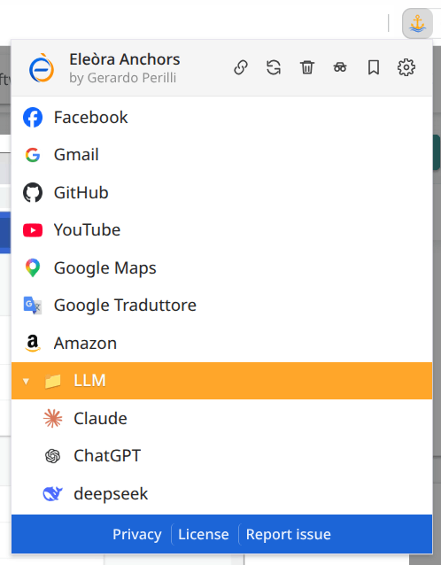

# Eleòra Anchors

A lightweight extension for Chromium-based browsers, designed for fast bookmark navigation and essential browser utilities — all in one clean popup.

---

## Screenshot

---

## Features

* **Bookmarks** — browse and navigate your bookmark tree instantly
* **Clean reload** — clear cache for the current site and reload
* **Clear data** — remove cache, history, downloads, form data and local storage (cookies excluded)
* **Copy sanitized URL** — copy the current page URL without tracking parameters
* **Incognito / InPrivate** — open a new private window in one click (terminology adapts to the browser)
* **Bookmarks manager** — quick access to the browser's bookmarks page
* **Settings** — quick access to browser settings
* **Context menu** — right-click bookmarks to open in different ways
* **Keyboard navigation** — support for arrows, Enter and Escape
* **Dark mode** — automatic via system preferences
* **Bilingual** — English and Italian, auto-detected from browser language

---

## Important notes

* **Clear data** removes:

  * cache
  * browsing history
  * downloads list
  * form data
  * IndexedDB / localStorage / service workers

  **Cookies are NOT removed**, so you stay logged in.

* **Clean reload** only clears cache for the **current site**, not globally.

* Some pages (e.g. `chrome://`, `file://`, extension pages) cannot be cleaned — in those cases, a normal reload is performed.

* To use the extension *inside* incognito/private mode, you need to enable it manually in your browser settings. This is disabled by default by Chromium-based browsers.

---

## How it works

* Bookmarks are read using the browser's native `chrome.bookmarks` API
* Favicons are retrieved via the browser's internal `_favicon` endpoint
* URL cleaning removes known tracking parameters (UTM, click IDs, affiliate IDs, etc.)
* All operations run **locally inside your browser**

---

## Permissions explained

* `bookmarks` → read and display bookmarks in the popup
* `tabs` → access the current tab URL when needed
* `windows` → open new browser windows, including incognito/private windows
* `browsingData` → clear cache and selected browsing data
* `clipboardWrite` → copy sanitized URLs to the clipboard
* `favicon` → display site icons next to bookmarks

---

## Compatibility

- ✔ Chrome
- ✔ Brave
- ✔ Edge
- ✔ Opera
- ✖ Firefox not supported

---

### Keyboard shortcuts

* `↑ / ↓` → navigate items
* `Enter` → open the selected item
* `Ctrl + Click` → open bookmark in a new tab
* `Esc` → close the context menu

---

## Privacy

No data collection, no analytics, no tracking, no external servers.

* No external network requests are performed
* No browsing data is sent outside your browser
* No bookmarks, URLs or clipboard contents are stored by the extension
* No third-party services are used

Full privacy policy:
https://eleora-dev.github.io/anchors/privacy.html

---

## Installation

### Chrome Web Store

*(coming soon)*

### Manual installation

1. Download or clone this repository
2. Open your browser's extensions page:
   * Chrome / Brave / Opera: `chrome://extensions/`
   * Edge: `edge://extensions/`
3. Enable **Developer mode**
4. Click **Load unpacked** and select the project folder

---

## License

MIT License — see [LICENSE](LICENSE)

---

## Author

Gerardo Perilli · [Eleòra](https://github.com/eleora-dev)
